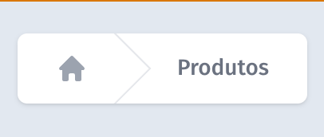
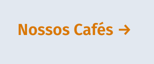
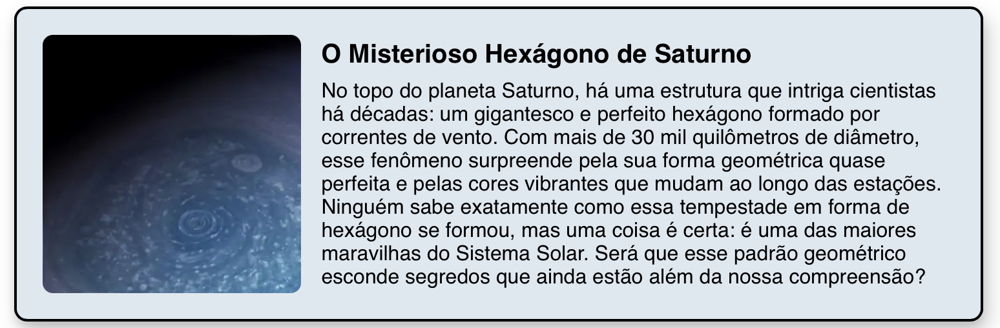
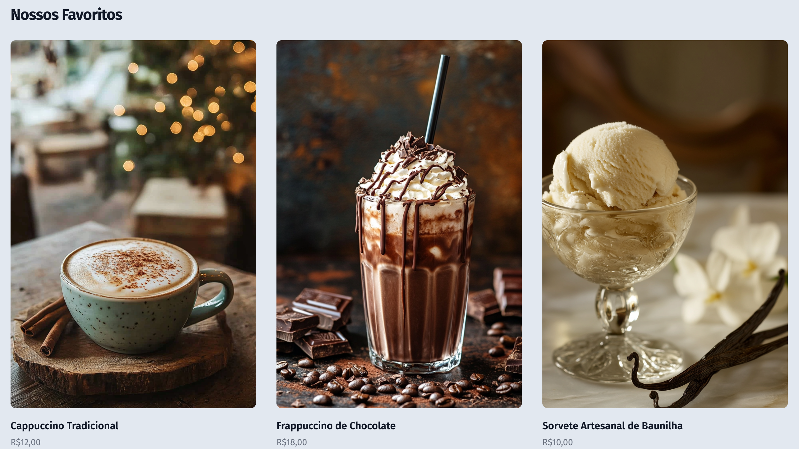

# Next.js 14 Coffee Shop - README

## Como Executar o Projeto

Este documento fornece um guia completo sobre como configurar e executar um projeto de uma cafeteria em Next.js, explicando em detalhes os conceitos do React e padrões de desenvolvimento utilizados. Vamos abordar os seguintes tópicos:

1. Estrutura de Projeto Next.js 14
2. Criação de componentes (simples e compostos)
3. Estilização com Tailwind CSS no React
4. Roteamento e navegação
5. Gerenciamento de estado e props
6. Padrões de design e boas práticas
7. Componentes reutilizáveis
8. Responsividade e design mobile-first

### Requisitos

- Node.js versão 14 ou superior
- npm ou yarn
- Next.js versão 14 ou superior
- Tailwind CSS
- Hero Icons (para ícones)
- React 18+

### Configuração Inicial

1. **Clone o repositório**:

   ```bash
   git clone <link-do-repositorio>
   cd coffee-shop-next
   ```

2. **Instale as dependências**:

   ```bash
   npm install
   # ou
   yarn install
   ```

3. **Configure o Tailwind CSS**:

   ```bash
   npx tailwindcss init -p
   ```

4. **Execute o servidor de desenvolvimento**:

   ```bash
   npm run dev
   # ou
   yarn dev
   ```

   O projeto estará disponível em `http://localhost:3000`.

## Componentes do Projeto

### 1. Sistema de Navegação

#### Breadcrumbs Component
O componente Breadcrumbs oferece navegação hierárquica intuitiva:



```jsx
import { HomeIcon } from '@heroicons/react/20/solid'
import Link from "next/link";

export default function Breadcrumbs({paginas}) {
  return (
    <nav aria-label="Breadcrumb" className="flex p-5">
      <ol role="list" className="flex space-x-4 rounded-md bg-white px-6 shadow">
        <li className="flex">
          <div className="flex items-center">
            <Link href="/" className="text-gray-400 hover:text-gray-500">
              <HomeIcon aria-hidden="true" className="h-5 w-5 flex-shrink-0" />
            </Link>
          </div>
        </li>
        {paginas.map((page) => (
          <li key={page.name} className="flex">
            <div className="flex items-center">
              <svg
                fill="currentColor"
                viewBox="0 0 24 44"
                preserveAspectRatio="none"
                className="h-full w-6 flex-shrink-0 text-gray-200"
              >
                <path d="M.293 0l22 22-22 22h1.414l22-22-22-22H.293z" />
              </svg>
              <Link
                href={page.href}
                aria-current={page.current ? 'page' : undefined}
                className="ml-4 text-sm font-medium text-gray-500 hover:text-gray-700"
              >
                {page.name}
              </Link>
            </div>
          </li>
        ))}
      </ol>
    </nav>
  )
}
```

#### Links Personalizados
Component para links estilizados consistentemente:



```jsx
const LinkPersonalizado = ({children, href}) => {
  return (
    <Link href={href}
          className="whitespace-nowrap font-semibold text-amber-600">
      {children} <span>&rarr;</span>
    </Link>
  )
}
```

### 2. Sistema de Produtos

#### Catálogo de Produtos
Estrutura de dados para produtos:

```jsx
const products = [
  {
    id: 1,
    name: 'Cappuccino Tradicional',
    price: 'R$12,00',
    href: '#',
    imageSrc: '...',
    imageAlt: 'Cappuccino com espuma cremosa e canela.',
  },
  // ... outros produtos
]
```

#### Product Card Component
Card individual para exibição de produto:



```jsx
function ProductCard(props) {
  return (
    <div className="group relative">
      <div className="h-96 w-full overflow-hidden rounded-lg sm:aspect-h-3 sm:aspect-w-2 group-hover:opacity-75 sm:h-auto">
        
      </div>
      <h3 className="mt-4 text-base font-semibold text-gray-900">
        <p>
          <span className="absolute inset-0"/>
          {props.product.name}
        </p>
      </h3>
      <p className="mt-1 text-sm text-gray-500 pb-5">{props.product.price}</p>
    </div>
  )
}
```

#### Products List Component
Lista de produtos com grid responsivo:



```jsx
function ProductsList(props) {
  return (
    <div className="mx-auto max-w-7xl px-4 py-16 sm:px-6 sm:py-8 lg:px-8">
      <div className="sm:flex sm:items-baseline sm:justify-between">
        <h2 className="text-2xl font-bold tracking-tight text-gray-900">
          Nossos Favoritos
        </h2>
      </div>
      <div className="mt-6 grid grid-cols-1 gap-y-10 sm:grid-cols-3 sm:gap-x-6 sm:gap-y-0 lg:gap-x-8">
        {products.map(props.callbackfn)}
      </div>
    </div>
  )
}
```

### 3. Componentes de Interface

#### Call-to-Action Buttons
Botões estilizados para ações principais:


```jsx
function CtaButton() {
  return (
    <div className="mt-10 flex items-center gap-x-6">
      <Link
        href="produtos"
        className="rounded-md bg-amber-600 px-3.5 py-2.5 text-sm font-semibold text-white shadow-sm hover:bg-amber-500 focus-visible:outline focus-visible:outline-2 focus-visible:outline-offset-2 focus-visible:outline-amber-600"
      >
        Peça agora
      </Link>
      <LinkPersonalizado href={"/nossosCafes"}>
        Nossos Cafés
      </LinkPersonalizado>
    </div>
  )
}
```

#### Info Panel Component
Painéis de estatísticas e informações:

```jsx
function InfoPanel(props) {
  return (
    <div className="flex flex-col bg-white/5 p-8">
      <dt className="text-sm font-semibold leading-6 text-gray-300">
        {props.stat.name}
      </dt>
      <dd className="order-first text-3xl font-semibold tracking-tight text-white">
        {props.stat.value}
      </dd>
    </div>
  )
}
```

## Páginas Principais

### 1. Página Inicial (Home)
A página inicial combina diversos componentes para criar uma experiência atraente:

```jsx
export default function Page() {
  return (
    <div className="relative bg-slate-200 h-screen">
      <div className="mx-auto max-w-7xl lg:grid lg:grid-cols-12 lg:gap-x-8 lg:px-8">
        <div className="px-6 pb-24 pt-10 sm:pb-32 lg:col-span-7 lg:px-0 lg:pb-56 lg:pt-48 xl:col-span-6">
          <div className="mx-auto max-w-2xl lg:mx-0">
            
            <div className="hidden sm:mt-32 sm:flex lg:mt-16">
              <div className="relative rounded-full px-3 py-1 text-sm leading-6 text-gray-500 ring-1 ring-gray-900/10 hover:ring-gray-900/20">
                Desfrute de uma experiência única em nossa cafeteria.
                <LinkPersonalizado href={"/sobre"}>Sobre</LinkPersonalizado>
              </div>
            </div>
            <h1 className="mt-24 text-4xl font-bold tracking-tight text-gray-900 sm:mt-10 sm:text-6xl">
              Coffee Co.
            </h1>
            <p className="mt-6 text-lg leading-8 text-gray-600">
              Saboreie nossos cafés especiais e sinta o aroma que encanta.
            </p>
            <CtaButton/>
          </div>
        </div>
        <VerticalImage/>
      </div>
    </div>
  )
}
```

### 2. Página de Produtos
A página de produtos utiliza o sistema de grid para exibir os produtos:

```jsx
export default function Page() {
  return (
    <div className="bg-slate-200 h-max">
      <Breadcrumbs paginas={[
        {name: 'Produtos', href: '/produtos', current: true},
      ]}/>
      <ProductsList callbackfn={(product) => (
        <ProductCard key={product.id} product={product}/>
      )}/>
    </div>
  )
}
```

## Padrões de Design e Boas Práticas

### 1. Componentização
- Componentes pequenos e reutilizáveis
- Separação clara de responsabilidades
- Props bem definidas e documentadas

### 2. Tailwind CSS
Utilizamos classes utilitárias do Tailwind para:
- Responsividade (`sm:`, `md:`, `lg:`, `xl:`)
- Hover states (`hover:`)
- Focus states (`focus:`, `focus-visible:`)
- Flexbox e Grid (`flex`, `grid`)
- Espaçamento e padding (`p-`, `m-`, `gap-`)

### 3. Mobile-First Design
```jsx
// Exemplo de classes responsivas
className="grid grid-cols-1 sm:grid-cols-2 md:grid-cols-3 lg:grid-cols-4"
```

### 4. Acessibilidade
- Uso de tags semânticas (`nav`, `main`, `section`)
- ARIA labels
- Contrast ratios adequados
- Focus management

## Gerenciamento de Estado

### 1. Props Drilling
Exemplo de como passamos dados através de componentes:

```jsx
// Página principal passando dados para ProductsList
<ProductsList 
  products={products}
  onProductClick={handleProductClick}
  layout="grid"
/>

// ProductsList passando para ProductCard
{products.map(product => (
  <ProductCard
    key={product.id}
    product={product}
    onClick={onProductClick}
  />
))}
```

### 2. Composição de Componentes
Exemplo de como componentes podem ser compostos:

```jsx
function Page() {
  return (
    <Layout>
      <Header>
        <Breadcrumbs paginas={[...]} />
      </Header>
      <Main>
        <ProductsList>
          <ProductCard />
        </ProductsList>
      </Main>
      <Footer />
    </Layout>
  )
}
```

## Conclusão

Este README fornece uma visão abrangente do projeto Coffee Shop em Next.js, demonstrando como diferentes componentes e técnicas trabalham juntos para criar uma aplicação web moderna e eficiente. O projeto serve como um excelente exemplo de:

- Arquitetura de componentes React
- Estilização com Tailwind CSS
- Padrões de design responsivo
- Boas práticas de desenvolvimento
- Acessibilidade web

Para mais informações sobre como expandir o projeto ou adicionar novas funcionalidades, consulte:
- [Documentação oficial do Next.js](https://nextjs.org/docs)
- [Documentação do Tailwind CSS](https://tailwindcss.com/docs)
- [React Documentation](https://react.dev)

### Próximos Passos

1. Implementar autenticação de usuários
2. Adicionar um carrinho de compras
3. Integrar com um sistema de pagamentos
4. Implementar um painel administrativo
5. Adicionar mais animações e transições
6. Implementar testes automatizados

Para contribuir com o projeto, por favor leia nosso guia de contribuição e siga as diretrizes de código estabelecidas.


-------------------------------------------------------------------------


# Next.js 14 Mistérios Cósmicos - README

Este projeto tem como objetivo demonstrar a criação e uso de componentes em React/Next, juntamente com a implementação de estilos utilizando CSS Modules.

## Como criar um componente
Criar um componente em `Next.js` é similar ao processo em React, mas seguindo a estrutura de diretórios de Next.js. Para começar, vamos criar um componente.

Componentes são blocos reutilizáveis de código. Cada componente pode ser uma parte da sua página, como um botão, uma imagem ou uma caixa de texto. Eles ajudam você a organizar melhor o código e a tornar as coisas mais fáceis de entender e usar. Para criá-lo: 

1. Crie uma pasta chamada components dentro do diretório src.
2. Dentro da pasta, crie o arquivo no estilo “nomeDoArquivo.js"

```jsx

export default function Card2({ foto, titulo, descricao, alt }) {
  return (
    <div className={styles.Card2Container}>
      

      <div className={styles.textContainer}>
        <h2 className={styles.h2Container}>{titulo}</h2>
        <p className={styles.eu}>{descricao}</p>
      </div>

    </div>
  );
}

```

Aqui, definimos o componente `Card2`. Ele usa a função `Card2` para criar uma parte da interface do usuário.
Os itens entre as chaves `({ foto, titulo, descricao, alt })` são propriedades (ou `props`) para criar um componente dinâmico, que você pode passar informações para o componente quando usá-lo. Isso permite que você reutilize esse componente em qualquer parte do projeto, passando diferentes valores.


`<div className={styles.Card2Container}>: Esta é uma div que serve como contêiner principal para o card. O estilo da classe Card2Container é aplicado a ela.


## CSS Module 

CSS Modules é uma maneira de escrever estilos (CSS) que ajuda a manter a organização deles e evita conflitos.
Quando você usa CSS Modules, cada classe que você define é única e não pode ser afetada por outras classes. Isso significa que, mesmo que você tenha duas classes com o mesmo nome em diferentes arquivos, elas não vão se misturar.

Quando você cria um arquivo CSS para um componente, você o importa diretamente no seu componente, como mostrado anteriormente:
 
```CSS
import styles from "./Card2.module.css";

export default function Card2({ foto, titulo, descricao, alt }) {
  return ()
}
   
```

No trecho acima, a classe card é única para esse componente. Se você tiver outra classe card em um arquivo CSS diferente, ela não vai interferir nesta.


Depois, no arquivo do css module, é só escrever o estilo da forma que desejar, como por exemplo:

```CSS

.Card2Container {
  display: flex;
  flex-direction: row;
  align-items: center; 
  gap: 16px; 
  background-color: rgb(222, 232, 240); 
  border: 2px solid rgb(0, 0, 0); 
  border-radius: 10px; 
  padding: 20px; 
  box-shadow: 4px 8px 16px rgba(0, 0, 0, 0.2), 
              0 4px 6px rgba(0, 0, 0, 0.1); 
  color: black;
  width: 80%;
  margin: 20px; 
}

  .imagem {
    width: 200px;
    height: 200px; 
    border-radius: 8px; 
    object-fit: cover;
  }
  
  .textContainer {
    display: flex;
    flex-direction: column; 
  }
  
  .h2Container {
    font-size: 20px;
    font-family: 'Open Sans', sans-serif;
    margin: 0;
  }
  
  .eu {
    font-size: 16px;
    font-family: 'Sorbian', sans-serif;
    margin: 8px 0 0 0; 
  }
  
   
```

Criando o card abaixo:


## Diferença entre CSS Modules e CSS Global

### CSS Global:
- As classes são globais, o que significa que qualquer classe que você definir pode ser usada em qualquer lugar. Isso pode causar conflitos se você tiver duas classes com o mesmo nome em arquivos diferentes.
- Pode ficar confuso à medida que sua aplicação cresce, já que todos os estilos estão misturados.
- Se você mudar um estilo, precisa ter cuidado para não afetar outros lugares onde a classe é usada.


### CSS Modules:
- As classes são locais ao componente. Cada classe tem um nome único, então você não precisa se preocupar com conflitos.
- Ajuda a manter os estilos organizados, pois cada componente tem seu próprio arquivo CSS.
- Você pode alterar um estilo em um componente sem se preocupar em quebrar outros componentes.


## Estrutura da página principal 

O arquivo page.js` é geralmente onde você define o que será exibido na sua página principa, onde você diz ao navegador o que deve ser mostrado para o usuário. Veja o exemplo:

```CSS
import styles from "./page.module.css";
import Card1 from "./components/Card1";
import Card2 from "./components/Card2";

export default function Home() {
  return (
    <div className={styles.container}>

    <Card1 
      titulo= "💫   Mistérios Cósmicos   ☄️"  
      descricao="O cosmos é um vasto oceano de mistérios esperando para ser desvendado. Desde as estrelas distantes até os planetas desconhecidos, cada canto do universo guarda segredos que desafiam nossa compreensão e acendem nossa curiosidade.
      Com bilhões de galáxias espalhadas pelo espaço, cada uma repleta de estrelas, planetas e sistemas inteiros, o universo nos convida a explorar suas fronteiras. Há tanto ainda por descobrir: mundos alienígenas orbitando sóis distantes, buracos negros escondidos na escuridão, e até mesmo possibilidades de vida além da Terra." 
      />
    
    <Card2
      foto= "https://i0.wp.com/ecoosfera.com/wp-content/uploads/2022/11/OTXPHDWQRRAEXENIRBLHGREUV4.jpg?resize=750%2C375&ssl=1"
      titulo= "O Misterioso Hexágono de Saturno"
      descricao= "No topo do planeta Saturno, há uma estrutura que intriga cientistas há décadas: um gigantesco e perfeito hexágono formado por correntes de vento. Com mais de 30 mil quilômetros de diâmetro, esse fenômeno surpreende pela sua forma geométrica quase perfeita e pelas cores vibrantes que mudam ao longo das estações. Ninguém sabe exatamente como essa tempestade em forma de hexágono se formou, mas uma coisa é certa: é uma das maiores maravilhas do Sistema Solar. Será que esse padrão geométrico esconde segredos que ainda estão além da nossa compreensão?"
    />

  </div>  
  );
}

```


Aqui, estamos importando o componente Card2 na sequencia onde queremos que ele apareça na tela. Como usamos `props` no componente, é aqui que vamos colocar o conteúdo do card.

Se quiser repetir o componente card, mas com outro conteúdo, basta somente acrescenta-lo novamente e adicionar outro conteúdo. Da seguinte forma:


```CSS
import styles from "./page.module.css";
import Card1 from "./components/Card1";
import Card2 from "./components/Card2";

export default function Home() {
  return (
    <div className={styles.container}>

    <Card1 
      titulo= "💫   Mistérios Cósmicos   ☄️"  
      descricao="O cosmos é um vasto oceano de mistérios esperando para ser desvendado. Desde as estrelas distantes até os planetas desconhecidos, cada canto do universo guarda segredos que desafiam nossa compreensão e acendem nossa curiosidade.
      Com bilhões de galáxias espalhadas pelo espaço, cada uma repleta de estrelas, planetas e sistemas inteiros, o universo nos convida a explorar suas fronteiras. Há tanto ainda por descobrir: mundos alienígenas orbitando sóis distantes, buracos negros escondidos na escuridão, e até mesmo possibilidades de vida além da Terra." 
      />
    
    <Card2
      foto= "https://i0.wp.com/ecoosfera.com/wp-content/uploads/2022/11/OTXPHDWQRRAEXENIRBLHGREUV4.jpg?resize=750%2C375&ssl=1"
      titulo= "O Misterioso Hexágono de Saturno"
      descricao= "No topo do planeta Saturno, há uma estrutura que intriga cientistas há décadas: um gigantesco e perfeito hexágono formado por correntes de vento. Com mais de 30 mil quilômetros de diâmetro, esse fenômeno surpreende pela sua forma geométrica quase perfeita e pelas cores vibrantes que mudam ao longo das estações. Ninguém sabe exatamente como essa tempestade em forma de hexágono se formou, mas uma coisa é certa: é uma das maiores maravilhas do Sistema Solar. Será que esse padrão geométrico esconde segredos que ainda estão além da nossa compreensão?"
    />

    <Card2
      foto="https://super.abril.com.br/wp-content/uploads/2016/12/galaxia.jpg?quality=70&w=1024&crop=1"
      titulo= "O Enigma da Energia Escura e a Expansão Acelerada do Universo"    
      descricao="A energia escura é uma das maiores incógnitas da cosmologia, composta por cerca de 68% do universo e responsável pela aceleração da sua expansão. Desde a década de 1990, observações de supernovas distantes mostraram que essa expansão não apenas continua, mas está acelerando, levando os cientistas a postularem a existência da energia escura.
      Pesquisadores da colaboração DESI (Dark Energy Spectroscopic Instrument) estão usando um novo espectrógrafo para mapear a distribuição de galáxias e buscar pistas sobre a natureza da energia escura. A pergunta central é se ela é uma forma de energia ou uma propriedade fundamental do espaço-tempo. Novas descobertas podem revelar os segredos da energia escura e mudar nossa compreensão das leis da física e do futuro do universo."
    />


  </div>  
  );
}

   
```

Formando assim, o projeto:


